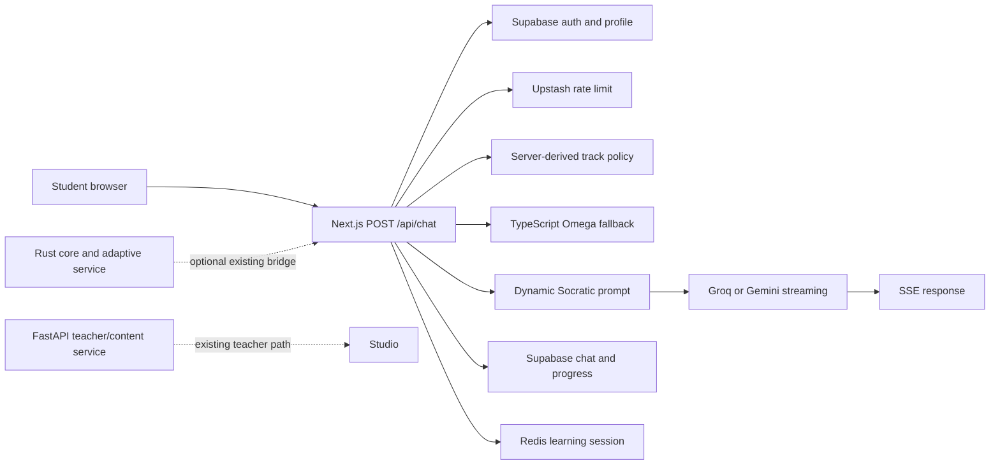
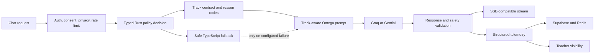

# Extended-Track Synthesis Tutor Architecture

**Status:** proposed implementation baseline

**Scope:** AI literacy, blockchain literacy, and financial literacy in SyncSenta Studio

**Design references:** [Ruflo](https://github.com/ruvnet/ruflo), [i-have-adhd](https://github.com/dgithinjibit/i-have-adhd), and [skills](https://github.com/dgithinjibit/skills). These repositories provide architectural patterns only. SyncSenta remains on its existing Next.js, TypeScript, Rust, Supabase, Redis, and FastAPI stack.

## Decision

SyncSenta will use **one Omega-aware Synthesis Tutor** with versioned track policies. The tutoring engine, session flow, streaming protocol, and persistence remain shared. A track policy contributes only domain objectives, examples, evidence requirements, safety boundaries, and offline alternatives.

The live chat API remains compatible. Existing subject slugs stay stable:

- `ai`
- `blockchain`
- `financial-literacy`

The product label for `ai` becomes **AI Literacy**. AGI remains an age-appropriate hypothetical concept inside the content, not the name or promise of the course. The blockchain label becomes **Blockchain Literacy** and does not imply cryptocurrency training.

## Current system boundary



The current production-sensitive path is `/api/chat`. It authenticates the learner, rate-limits the request, derives the learning track from the server-side subject slug, computes Omega scaffolding, builds a dynamic prompt, streams the LLM response, and persists progress. Rust already contains the deterministic scaffolding policy and an adaptive-question service, but the TypeScript implementation remains the active chat fallback.

## Target boundary



Rust owns deterministic and safety-sensitive decisions. TypeScript owns request validation, server orchestration, prompt composition, and compatibility fallback. Python remains responsible for existing teacher/content-generation workflows and is not added to the student chat path.

## Shared track contract

The server derives the track. The learner cannot use the request body to grant permissions or change safety rules.

```ts
type ExtendedTrack = 'ai' | 'blockchain' | 'financial-literacy';

type TrackContext = {
  track: ExtendedTrack;
  grade: string;
  cbcLevel: string;
  objectiveId?: string;
  contentVersion: string;
  language: 'english' | 'kiswahili' | 'mixed';
  scaffolding: 'Independent' | 'Guided' | 'Intensive';
  policyReason: string;
  evidencePrompt: string;
  safetyBoundary: string;
  offlineAlternative: string;
};
```

The implementation must preserve the existing `POST /api/chat` request and SSE response. New fields are internal first. Any future client-visible metadata must be additive and optional.

## Tutor turn contract

Every track uses the same learning loop:

1. Orient the learner with one short objective.
2. Elicit a prediction, observation, calculation, or existing idea.
3. Ask for reasoning or evidence before a full explanation when safe.
4. Apply Omega scaffolding.
5. Verify with a source, observation, experiment, calculation, or uncertainty statement.
6. Transfer the idea to a new local or fictional scenario.
7. Close with retrieval, reflection, and an offline next step.

Independent mode should favor retrieval and transfer. Guided mode should ask one focused question and provide one cue. Intensive mode should use the smallest possible step, short turns, concrete Kenyan examples, and frequent checks. The tutor should accept oral, drawn, handwritten, collaborative, and offline responses where the activity supports them.

## Track boundaries

### AI literacy

Teach data, patterns, prompts, uncertainty, bias, privacy, evaluation, and human responsibility. Use local problems such as weather, water, agriculture, accessibility, and language. AGI is explicitly hypothetical. The tutor must not claim consciousness, inevitability, guaranteed job replacement, or financial gain.

### Blockchain literacy

Teach records, shared ledgers, hashes, consensus, governance, privacy, and the trade-off between distributed systems and ordinary databases. Use paper simulations and fictional case studies. The tutor must not request wallets, seed phrases, private keys, credentials, payments, or trading actions. Blockchain and crypto-assets must be explained as different concepts.

### Financial literacy

Teach needs and wants, budgeting, saving, receipts, opportunity cost, borrowing, fees, risk, scams, and consumer protection. Use fictional Kenyan-shilling scenarios and offline alternatives. The tutor must not provide personalized investment, credit, insurance, tax, provider, or payment advice.

## Ruflo-inspired orchestration rules

Ruflo's useful pattern is bounded coordination, not runtime coupling. For future multi-file changes, use named responsibilities such as architect, implementation, tester, and safety reviewer with one coordinator owning the final contract. Parallel workers must not edit the same file concurrently. Small changes should skip orchestration overhead.

No Ruflo package is required for this architecture. If orchestration is later introduced, it must be an offline developer workflow or a separately permissioned service. It must not be allowed to alter learner safety, consent, policy, or external-action decisions.

## ADHD-friendly learner and developer experience

The learner interface should keep turns short, present one idea at a time, show a clear next choice, and avoid shame when an answer is wrong. The development workflow should lead with the next action, preserve visible state, make wins and failures explicit, and end each phase with one concrete next step. These are interaction and delivery principles, not a medical diagnosis or a requirement to hide important detail.

## Safety and privacy invariants

- Consent and age mediation occur before open-ended child-facing use.
- The tutor does not request passwords, PINs, OTPs, national IDs, account numbers, private keys, seed phrases, exact location, or private family data.
- Identifiable learner records are never written to a public or immutable ledger.
- The model cannot grade, rank, diagnose, discipline, or make financial, legal, medical, identity, or safeguarding decisions autonomously.
- Real-money, fraud, coercion, abuse, or distress reports route to a trusted adult or appropriate official source.
- AI, blockchain, and financial claims use dated or authoritative sources when the subject is legally or factually changeable.

## Rollout and rollback

### Phase 1: terminology and policy hardening

Change only labels, track policy text, prompt tests, and documentation. Preserve slugs and API shapes. This phase is safe to roll back as a small commit.

### Phase 2: Rust contract

Add a Rust-owned typed track contract and policy fixtures without enabling a new network route. Verify deterministic results and keep the TypeScript implementation as a safe fallback.

### Phase 3: opt-in Rust bridge

Expose the Rust contract through an additive service endpoint or existing service boundary. Enable it only behind an environment flag after parity tests pass. If the bridge fails, fall back to the existing TypeScript policy without changing the learner-visible route.

### Phase 4: curriculum expansion

Add one teacher-reviewed module per track, then age-band, language, accessibility, and offline variants. Do not expand the chat surface until safety red-team tests and learning-transfer checks pass.

## Verification matrix

| Layer | Required check |
|---|---|
| Rust | Policy unit tests, safety boundary tests, JSON contract tests, and deterministic scaffolding parity fixtures |
| TypeScript | Track alias tests, prompt boundary tests, Omega boundary tests, and fallback behavior tests |
| API | Existing auth, rate-limit, request-shape, SSE, persistence, and compass-mode tests remain green |
| Child safety | Refusal of credentials, private keys, real transactions, personalized financial advice, and high-stakes decisions |
| Accessibility | Short-turn behavior, language routes, offline alternative metadata, and non-shaming error wording |
| Operations | Focused tests, full test suite, type-check, lint, build, Rust test suite, and clean intentional diff |

## Grilling record

The design was rejected if it required any of the following: a new parallel tutor for each subject, a new Python dependency on the student path, a breaking change to `/api/chat`, a direct copy of Ruflo runtime code, a hidden learner-data store, autonomous financial actions, or AGI claims presented as current capability.

The smallest useful implementation is therefore policy hardening plus a Rust contract with an opt-in bridge. It improves safety and terminology immediately while preserving the current site and leaving a reversible path toward Rust-first production policy enforcement.
