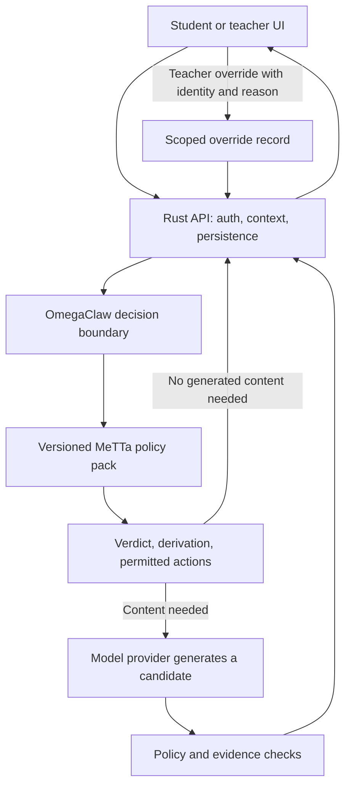

# MeTTa and OmegaClaw Target Architecture

**Status: Proposal, not yet adopted.** This document describes a migration target. It does not change the current production runtime or authorize a live cutover.

## Target

MeTTa is the versioned source of policy and decision rules. One Rust API authenticates requests, gathers trusted context, invokes the rule runtime, and persists decisions. The web application renders the result. A language model may draft content, but it does not own policy or decide whether an action is allowed.



The response contract should carry the decision, policy version or hash, derivation/provenance, permitted next actions, and any review requirement. The exact schema is a separate design decision; it must be stable before callers migrate.

## Boundaries

- **MeTTa owns:** policy facts and rules for safety, consent, eligibility, scope, hints, progression, assessment gates, and tool/action permissions. It returns structured decisions, not arbitrary UI markup.
- **Rust owns:** HTTP/API behavior, authentication and authorization, input validation, data access, session orchestration, model-provider calls, persistence, and enforcement of the MeTTa result.
- **The model owns:** drafting language or candidate learning content when the decision permits it. The model is not the policy authority; its output remains subject to grounding, validation, and review requirements.
- **The web app owns:** student/teacher workflows and rendering. It should not contain a second implementation of policy rules.
- **Curriculum content remains data:** move a curriculum fact into MeTTa only when it is needed for a policy decision. Do not translate every content record or application file into rules.
- **Teacher overrides remain separate records:** keep the base pack versioned and immutable. Store the teacher, scope, reason, timestamp, and affected decision; evaluate the authorized override on the next request. Define which safety and consent rules are non-overridable before implementation.

## Migration Without a Big Bang

1. Record current behavior as golden cases for each decision family: typed input, verdict, explanation/provenance, and permitted action. Include student and teacher workflows that already work.
2. Prove the chosen Rust MeTTa runtime on those cases in CI. The Python Hyperon development test is useful evidence about the policy, but it does not prove the Rust production path.
3. Migrate one bounded policy family at a time behind the existing API contract. Keep the current path serving until the new implementation matches the golden cases.
4. Run the candidate engine in shadow mode using synthetic or approved test data. Compare decisions and derivations; do not let shadow results affect learners.
5. Cut over one family only after parity, security, latency, and staging workflow gates pass. Keep rollback to the previous service release, not a permanently maintained second rule implementation.
6. Delete a replaced TypeScript or Python policy copy in the same cutover that makes the new runtime authoritative. Update the decision record and roadmap at that point.

## Tradeoffs

| Benefit | Cost or risk | Control |
|---|---|---|
| One auditable policy voice across the AI decision paths | Migration work across Rust, Python service callers, TypeScript callers, tests, and deployment | Move one decision family at a time; preserve API contracts and existing workflow tests |
| Decisions can cite a policy version and derivation for teacher review | MeTTa/Hyperon adds runtime, build, and debugging complexity; the Rust embedding path is not yet proven in production | Make a successful Rust CI build and real-interpreter golden suite a gate, not an assumption |
| Teachers can override a decision and have it affect the next interaction | Override scope and precedence can create safety, privacy, or audit risks | Persist scoped, named overrides; explicitly define non-overridable rules; test the next-request effect |
| Policy changes no longer require parallel edits to multiple rule engines | A shared API/runtime can become a wider failure point | Fail closed for protected decisions, monitor health, and keep deployment rollback independent of rule duplication |
| Model generation can be constrained by explicit policy | MeTTa does not make generated explanations factually correct by itself | Keep curriculum/evidence grounding, output validation, and human review where required |

“Fully MeTTa/OmegaClaw” should therefore mean **one MeTTa authority for AI policy and decisions**, not that networking, storage, UI, model inference, and curriculum authoring are all rewritten in MeTTa. Use “OmegaClaw” for this project's decision system; this proposal does not claim use of the separate SingularityNET Omega project.

## Existing Decisions and Evidence

- [One rule voice decision](decision-one-rule-voice.md) records the accepted Rust-authority and thin-UI direction. This proposal would need an explicit amendment if it changes the selected Rust interpreter or cutover conditions.
- [Scope and Omega status](../SCOPE-SECURITY-AND-OMEGA.md) records the open execution and integration gates.
- [North Star](../BASIX-NORTH-STAR.md) defines the product bar: visible derivations, real teacher overrides, and trustworthy records.

## Current Code Reality (2026-10-01)

This is a code-path inventory, not a claim that every path is deployed or browser-verified. The current code has several distinct rule/generation paths; they are not one Omega runtime:

```mermaid
flowchart TD
  subgraph learner[Student Mwalimu path]
    Student[Student UI] --> MwalimuRoute[/api/mwalimu]
    MwalimuRoute --> Pipeline[runMwalimuTurn]
    Pipeline --> LearnerState[Supabase learner state]
    Pipeline --> Context[CBC and active scheme context]
    Pipeline --> Provider[Multi-provider model generation]
    Pipeline -. optional, 1.5s fail-open .-> Pedagogy[METTA_BASE pedagogy and validation endpoints]
    Provider --> Validation[Optional MeTTa post-validation]
    Validation --> Reply[Recorded tutor response]
  end

  subgraph challenge[OmegaClaw student challenge]
    ChallengeUI[Challenge UI] --> RuleRoute[/api/omega-claw hint and progression]
    RuleRoute -->|SYNCSENTA_BACKEND_URL set| RustOmega[Rust façade + omega_claw_rules.metta]
    RuleRoute -->|unset| TSMirror[TypeScript omega-claw-rules mirror]
    ChallengeUI --> ChallengeRoute[/api/omega-claw/challenge]
    ChallengeRoute --> ChallengeDB[Next route writes challenge progress to Supabase]
  end

  subgraph teacher[Teacher lesson-plan paths]
    Teacher[Teacher UI] --> SchemeDialog[SchemeRow lesson-plan dialog]
    SchemeDialog --> NextPlan[/api/generate/lesson-plan]
    NextPlan -->|service reachable| PythonPlan[Python Lesson Architect]
    NextPlan -->|service unavailable/error| Template[Prescribed local template]
    PythonPlan --> PlanProvider[Configured model provider]
    Teacher --> GenericDialog[Generic Genkit lesson-plan dialog]
    GenericDialog --> Genkit[Genkit prompt and model]
    Genkit -. AI/blockchain topic context only .-> OmegaContext[OmegaClaw curriculum helper]
  end

  subgraph checker[Grade 8 AI scheme checker]
    Checker[Browser /omega/check or node scripts/reconcile.mts] --> Deriver[TypeScript MeTTa-subset derivation]
    Deriver --> Facts[ai_g8_design.metta]
    Deriver --> Policy[scheme_check.metta]
    Deriver --> Record[Findings, ledger, and override artifacts]
  end

  subgraph telemetry[Python Hyperon policy path]
    Events[Agent telemetry] --> Evaluator[get_policy_evaluator]
    Evaluator --> Hyperon[HyperonPolicyEvaluator]
    Evaluator --> Fallback[Pure-Python fallback]
    Hyperon --> PolicyPack[metta-logic/syncsenta_policy.metta]
    Hyperon --> Verdict[Verdict attached to telemetry profile]
    Fallback --> Verdict
  end
```

Important distinctions visible in the code:

- `/api/omega-claw/*` forwards to Rust only when `SYNCSENTA_BACKEND_URL` is set; otherwise rule endpoints use the TypeScript mirror. The Rust pack covers Grade 6 introductory and Senior School AI/blockchain scope, not general Grade 8 Kiswahili pedagogy.
- The Grade 8 AI scheme checker reads two `.metta` files, but evaluates a supported subset in TypeScript. It is not the Python Hyperon evaluator or the Rust OmegaClaw runtime.
- Mwalimu calls model generation as the main response path. Its MeTTa pedagogy and validation HTTP calls are optional, point by default at `localhost:8080`, and return `null` on failure; they are not a hard policy gate in this pipeline.
- The Python Hyperon evaluator loads `metta-logic/syncsenta_policy.metta`. A confirmed call site is telemetry analysis, where the verdict is recorded in the behavioral profile; that is not the OmegaClaw student challenge pack.
- The telemetry caller computes `telemetry_data` but does not pass it into `PolicyRequest`; it supplies fixed `age_band="unknown"`, `consent="unknown"`, and `safety_signal="clear"` values, then logs and attaches the verdict. The MeTTa pack treats unknown age as consent-ok, so this call does not demonstrate event-specific consent/safety enforcement or block an action.
- The code contains multiple teacher lesson-plan entrypoints. The scheme-row dialog posts to the Next route and that route can return a successful prescribed template when the Python service is missing or fails. The dialog checks the plan shape but does not surface `source` or `fallback_reason`, so a template can look like an AI-generated plan.

## Monday Scenario: Grade 8 Kiswahili

**Code-based answer: a teacher may be able to obtain a draft, but the current code does not establish a reliable, curriculum-validated Grade 8 Kiswahili lesson-plan workflow. Do not present it as ready for classroom use without teacher verification.**

Evidence from implementation:

- `getSubjectsForGrade('Grade 8')` offers AI Literacy, Blockchain Literacy, Computer Science, and English. Kiswahili is absent, so the normal lesson-plan form does not offer that subject for Grade 8.
- `getHardcodedStrands('Grade 8', 'Kiswahili')` falls through to generic “Guided Foundations.” The curated curriculum directory has Grade 7–9 English, Mathematics, Integrated Science, and Social Studies modules, but no Grade 8 Kiswahili module. This is not a Kiswahili-specific CBC strand/outcome source.
- A caller that supplies a Grade 8 Kiswahili `SchemeRow` directly can reach `/api/generate/lesson-plan`. If the Python Lesson Architect and its configured model provider are reachable, it can produce a structured draft from the supplied row. That path does not fetch a verified Grade 8 Kiswahili curriculum pack, and the OmegaClaw curriculum-context helper only adds its special context for AI/blockchain topics in its supported stages.
- If the service is unavailable, the Next route builds generic prescribed text and returns `success: true` with a `source` and `fallback_reason`. The scheme-row dialog ignores those two fields. In this fallback, missing strand/outcome data can become generic “Mada ya somo” objectives and activities, not evidence of KICD alignment.
- The generic teacher dialog is a separate Genkit path and does not make the missing curated Grade 8 Kiswahili curriculum data appear. The Grade 8 AI scheme checker is also a separate feature and does not validate a Kiswahili plan.

Therefore the narrow Monday readiness verdict is: **the product has a lesson-plan-shaped UI and generation code, but the standard curated Grade 8 Kiswahili path is not supported by the current subject/curriculum data; an arbitrary generated document is possible, not proven curriculum-correct.** This assessment is based on repository code. It does not verify the currently deployed Vercel/Render configuration, live provider credentials, or a browser session.

## First Repair Slice for This Scenario

1. Obtain and review an approved Grade 8 Kiswahili curriculum source; do not invent strands or learning outcomes to fill the gap.
2. Add the reviewed grade/subject/strand data and expose Grade 8 Kiswahili in the same selector that consumes it. Add a test proving both the subject option and its strands/outcomes exist.
3. Require a selected curriculum row or explicit teacher-authored objectives before generation. Reject or visibly label requests that have no reviewed grounding.
4. Make the lesson-plan route return an explicit provenance state (`model-generated`, `prescribed-template`, or `unavailable`) and render that state in the dialog. A template must never be presented as a generated curriculum-validated plan.
5. Add an end-to-end test for Grade 8 Kiswahili: selected curriculum row → API payload → generated/fallback provenance → displayed plan. Include provider-down behavior and assert that the teacher sees the fallback warning.
6. Only after this surface is grounded should OmegaClaw/MeTTa receive a decision rule for scope, safety, review, and allowed next actions. MeTTa should not manufacture missing curriculum content.